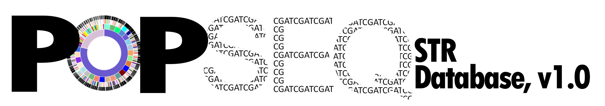

# Human STR Sequence Diversity Database v1.0

https://popseq.cvm.ncsu.edu

This Repository contains on interactive Sunburst model to view the summary of data using the KRONA utility https://github.com/marbl/Krona/wiki. 

Download the .html file and open using your preferred Web browser.  Most systems will luanch your default browser when you click to open the file.

S. Faith

NC State University

18 Aug 2017

safaith@ncsu.edu

